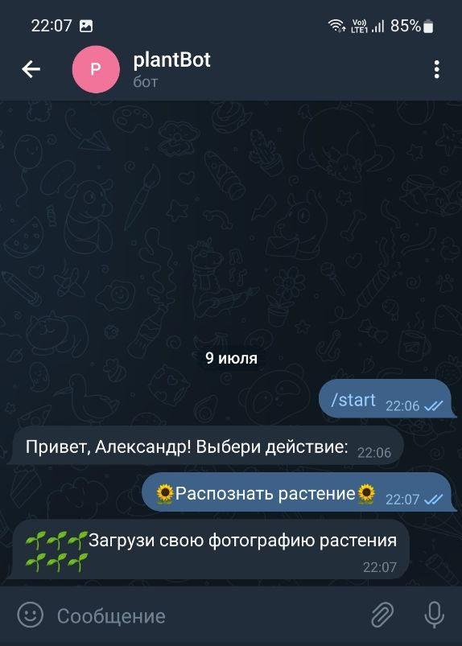
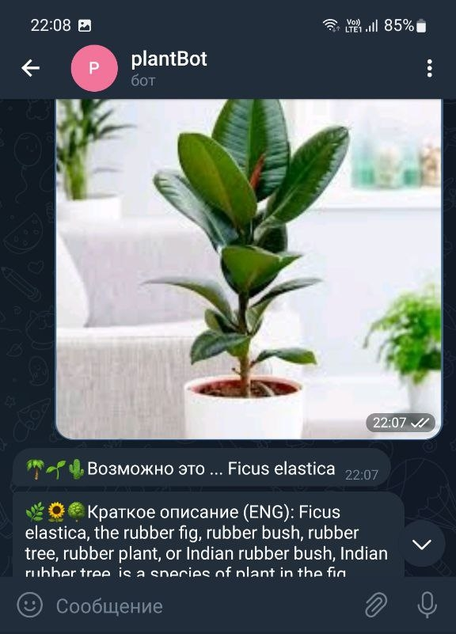
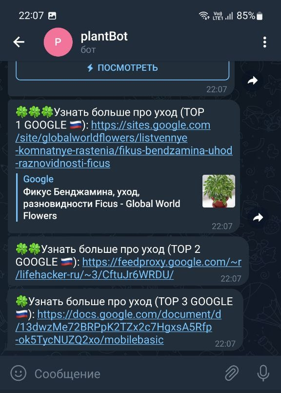

# plantBot
<h3>Телеграм-бот для распознавания растения по фотографии.</h3>

Этот телеграм-бот поможет вам узнать название вашего растения и порекомендует статьи по уходу (топ 3 запроса Google).
Вам необходимо отправить только фотографию.

### Начало работы

###
_Рисунок 1._ Запускаем бота

### Загружаем фото

###
_Рисунок 2._ Название и краткое описание растения.

### Советы по уходу

###
_Рисунок 3._ Топ-3 запроса google по уходу.

###
P.S. Бот работает не только с комнатными растениями! 

### Запуск
Для запуска программы используйте команду _npm start_
